# 원자 모형

19세기 초, **존 돌턴(John Dalton)**이라는 과학자가 아주 흥미로운 사실을 발견했어요—**배수비 법칙(Law of Multiple Proportions)**이죠.

그는 원자들이 화합물을 만들 때 항상 **정수 비율로 결합**한다는 것을 알아냈어요.
예를 들어, 질소의 양을 일정하게 유지하면, 질소 산화물에서 산소의 양은 단순한 패턴을 따릅니다—N₂O, NO, NO₂ 같은 경우, 1:2:4 비율을 보이죠.

실험 결과를 모아 돌턴은 **원자론**(Atomic Theory)을 세웠고, 이전의 발견들을 바탕으로 이를 뒷받침했어요:

* 질량보존의 법칙 – 앙투앙 라부아지에
* 정비례 법칙 – 조제프 프루스트
* 배수비 법칙 – 존 돌턴 본인

그리고 돌턴의 핵심 아이디어는 다음과 같아요:

* 모든 물질은 아주 작고 나눌 수 없는 원자로 이루어져 있다.
* 같은 원소의 원자는 동일한 질량과 성질을 가진다.
* 화학 반응 동안 원자는 생성되거나 파괴되지 않고, 단지 재배열될 뿐이다.
* 화합물은 서로 다른 원소의 원자가 정해진 비율로 결합할 때 형성된다.

하지만… 돌턴의 모형이 완벽했던 건 아니에요.
그의 초기 논문에는 몇 가지 부정확한 점이 있었고, 이후 아보가드로와 운동론, 통계학을 연구한 과학자들이 이를 다듬고 확장하여 오늘날 우리가 알고 있는 훨씬 더 완전한 원자 모형을 만들어냈죠.  

---

가장 작은 입자조차 가장 큰 발견으로 이어질 수 있답니다, 그렇지 않나요?  

## 전자의 발견

지금까지 우리는 원자가 일반적인 화학 반응으로는 나눌 수 없다는 것을 배웠죠…  
그런데—만약 우리가 **더 깊이 들여다본다면** 어떨까요?  

1897년, **조지프 J. 톰슨(Joseph J. Thomson)**은 **음극선(cathode rays)**이라는 신비로운 현상을 연구하기 시작했어요.  
이 음극선은 저압 가스로 채워진 관 속에서, 높은 전압이 걸릴 때 **음극에서 방출**되는 빛줄기였죠.  

톰슨은 전기장과 자기장을 적용하며 흥미로운 사실을 발견했어요—음극선이 **휘어진다는 것**이었죠!  
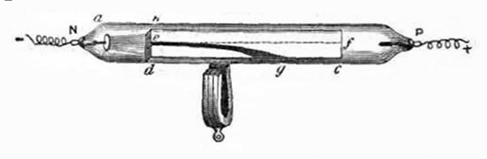  
이 휘어짐은 음극선이 **전하를 가지고 있다**는 걸 보여줬어요. 마치 움직이는 입자처럼요.  

---

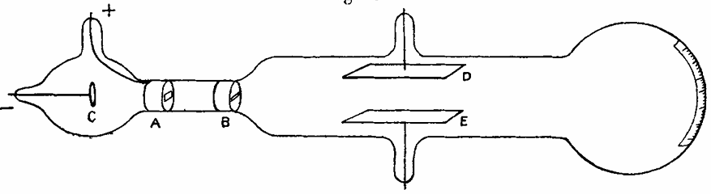  
정밀한 측정을 통해, 톰슨은 음극선이 **전하를 띤 입자들의 흐름**이라는 것을 알아냈어요.  
자기력과 전기력을 **완벽하게 균형**시켜 빔이 **정확히 직선으로 가도록** 만들면, 입자의 질량 대비 전하 비율, 즉 $e/m$을 계산할 수 있었죠.  

$$e/m = -9.1 \times 10^{10}~C/kg$$  
$$(현대값:~-1.76 \times 10^{11}~C/kg)$$  

이 값은 수소 이온($+9.6 \times 10^{7}~C/kg$)보다 **훨씬 크다는 것**을 의미했어요.  
즉, 음극선 속 입자는 **원자보다 훨씬 작은 입자**라는 것이었죠!  

확실히 하기 위해 톰슨은 음극에 다양한 금속을 사용해 보았지만—$e/m$ 비율은 거의 변하지 않았어요.  
그래서 그는 놀라운 결론에 도달했죠:  
> 이 작고 음전하를 가진 입자들은 **보편적**이다—모든 원자 속에 존재한다.  

이렇게 해서 바로 **전자**(electron)가 발견되었답니다.  

---

1905년, 이 발견을 바탕으로 톰슨은 원자를 새롭게 상상하는 방법을 제안했어요.  
그는 음전하를 띤 전자들이 **양전하 구체** 안에 박혀 있다고 생각했죠,  
마치 푸딩 속에 흩뿌려진 건포도처럼요.  
  
이를 **건포도 푸딩 모형**(Plum Pudding Model)이라고 불렀답니다.  
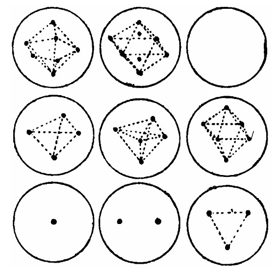  

처음에는 합리적으로 보였어요—전자들이 고르게 배치되어, 양전하 “젤리” 속에서 부드럽게 진동할 수 있으니까요.  
수학적으로도 안정적으로 보였지만… 물리학은 다른 이야기를 하고 있었죠.  

전자들은 움직이면서 가속하므로, 끊임없이 **에너지를 방출해야 했고**, 결국 원자는 **붕괴**하게 될 수밖에 없었어요!  
이 불안정성은 나중에 **어니스트 러더퍼드**(Ernest Rutherford) 같은 과학자들이 원자 구조를 완전히 재고하게 만드는 핵심 문제가 되었답니다.  

심지어 우아해 보이는 이론도, 더 깊은 신비를 숨기고 있어요.  
적절한 질문을 던져야만 그 비밀이 드러나죠…  

## 원자핵의 발견

톰슨의 모형은 원자 속에 **전자**가 존재한다는 것을 보여주었죠.  
하지만… 자연스럽게 이런 질문이 떠오르지 않나요?  
전자들은 음전하를 띠는데, 그렇다면 **양전하는 어디에 있을까요**?  

---

1909년, **어니스트 러더퍼드**(Ernest Rutherford)는 **한스 가이거**(Hans Geiger), **어니스트 마스든**(Ernest Marsden)과 함께 그 답을 찾기로 했어요.  
그들은 **알파선**(alpha rays)을 연구하고 있었죠—무겁고 양전하를 띤 입자들로 이루어진 방사선이에요.  
각 알파 입자는 +2e의 전하를 가지고 있으며, 질량은 거의 원자와 비슷했답니다.  

이 입자들이 물질과 어떻게 상호작용하는지 알아보기 위해, 가이거와 마스든은 알파 입자 빔을 극도로 얇은 금박에 쏘아 보았어요.  
두께는 약 $10^{-7}$미터에 불과했죠.  
톰슨의 **건포도 푸딩 모형**대로라면, 간단해야 했어요:  
원자가 부드러운 양전하 젤리라면, 알파 입자는 거의 곧장 통과하고 약간만 휘어져야 했죠—마치 안개를 뚫고 날아가는 작은 포탄처럼요.  

하지만 실제로 관찰된 것은… **충격적**이었어요.
몇몇 알파 입자는 크게 휘어졌고, 일부는 아예 **되튕겨 돌아갔어요**!
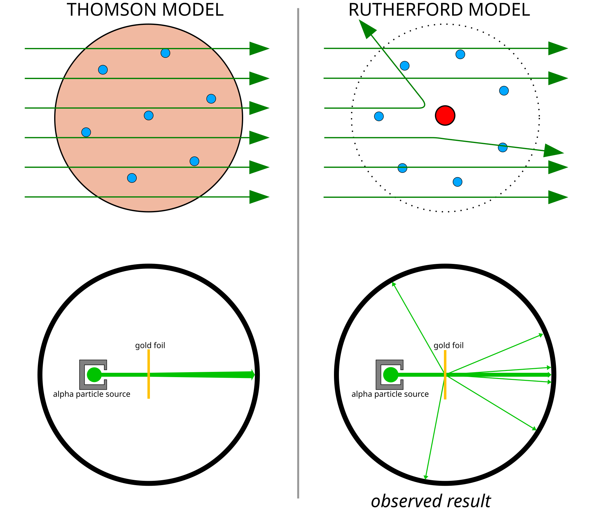  

---

1911년, 이 실험을 감독한 러더퍼드는 이 신비를 설명하기 위해 **새로운 원자 모형**을 제안했어요.  
그는 원자가 **작고 밀도가 높은 양전하 중심**을 가지고 있어야 한다고 생각했죠—강력한 힘으로 알파 입자를 밀어내는 작은 핵심이었어요.  
이 중심 영역이 바로 **원자핵**(nucleus)이며, 전자들은 **주위를 도는 궤도**를 가진다고 상상했답니다.  
마치 행성이 태양 주위를 도는 것처럼요.  

톰슨의 모형으로는 이렇게 큰 각도로 입자가 산란되는 현상을 설명할 수 없었지만,  
러더퍼드의 핵 모델은 완벽하게 설명할 수 있었어요.  

---

러더퍼드는 실험의 **이론적 틀**도 개발했답니다.  
알파 입자가 원자핵에 얼마나 가까이 접근할 수 있는지 계산했어요.  
핵과 알파 입자 모두 양전하를 띠므로 **쿨롱 반발력**(Coulomb repulsion)으로 서로 밀어내고,  
입자의 운동 에너지가 모두 전기적 위치 에너지로 변하면 입자가 멈추게 되죠:  

$$E_{\alpha} = \frac{1}{4\pi\epsilon_{0}} \frac{q_{\alpha} q_{Z}}{r_{min}}$$  

여기서:  

* $E_{\alpha}$ — 알파 이자의 운동 에너지  
* $\epsilon_{0}$ — 진공 유전율 ($8.854 \times 10^{-12}~F/m$)  
* $r_{min}$ — 알파 입자가 핵에 접근할 수 있는 최소 거리  
* $q_{\alpha}$ — 알파 입자의 전하 $(+2e_0)$  
* $q_Z$ — 원자핵의 전하  

러더퍼드는  $r_{min} = 3 \times 10^{-14}~m$라는 결과를 얻었어요 — **원자 크기보다 훨씬 작죠**.  
즉, 원자의 질량과 양전하는 거의 모두  
작은 중심 **원자핵** 안에 집중되어 있다는 의미였어요.  

---

알파 입자가 어떻게 산란되는지 설명하기 위해, 러더퍼드는 입자의 경로를 **쌍곡선 궤도**(hyperbolic orbit)로 모델링하고, **산란각**(scattering angle) 공식을 도출했답니다:  

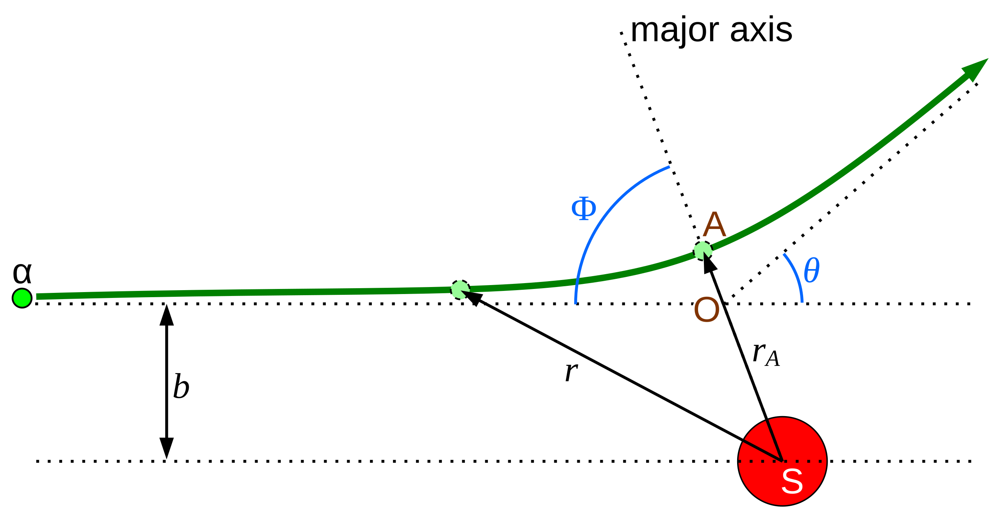  
$$\theta = 2~arctan\left(\frac{r_{min}}{2b}\right) = 2~arctan\left(\frac{1}{4\pi\epsilon_{0}} \frac{q_{\alpha}q_{Z}}{2bE_{\alpha}}\right)$$  

여기서:  

* $\theta$ — 산란각  
* $b$ — **충격 매개변수**(impact parameter), 알파 입자 경로와 핵 사이의 최소 측면 거리  

---

작은 스크린의 몇 번의 섬광만으로도, 러더퍼드는 물질에 대한 **완전히 새로운 시각**을 제시했죠—원자의 진정한 중심, **핵**이 드디어 모습을 드러낸 거예요.  

### 각 각도에서 얼마나 많은 입자가 산란될까?

**톰슨 모델**과 **러더퍼드 모델**의 핵심 차이는 바로 입자들이 산란되는 방식에 있어요.  
왜 일부 알파 입자가 뒤로 튕겨 나가는지 이해하려면, 산란각이 어떻게 변하는지 살펴봐야 해요.  

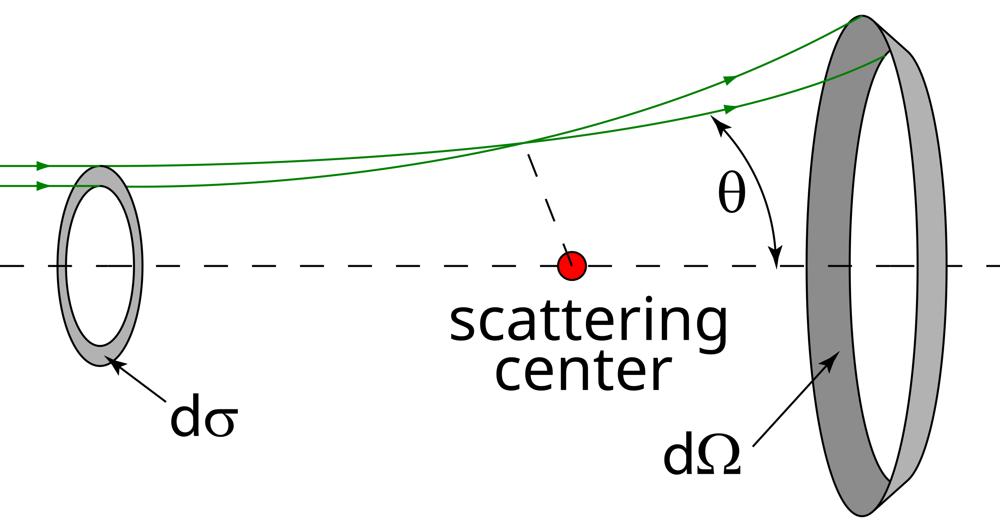

러더퍼드는 **미소 단면적**(differential cross section)을 사용해, 입자가 특정 각도로 산란될 **확률**을 계산했답니다:  

$$\frac{d\sigma}{d\Omega}=\left(\frac{1}{4\pi\epsilon_{0}}\frac{q_{\alpha}q_{Z}}{4E_{\alpha}}\right)^{2}\frac{1}{sin^{4}(\theta/2)}$$  

산란각($d\Omega = 2\pi sin(\theta)d\theta$)으로 표현하면:  

$$\frac{d\sigma}{d\theta}=\left(\frac{1}{4\pi\epsilon_{0}}\frac{q_{\alpha}q_{Z}}{4E_{\alpha}}\right)^{2}\frac{cos(\theta/2)}{sin^{3}(\theta/2)}$$  

이 공식은 대부분의 입자는 작은 각도로 통과하지만, **일부 입자는 크게 산란**하며—심지어 뒤로 튕겨 나갈 수도 있음을 예측했어요.  
가이거와 마스든의 관찰 결과와 정확히 일치했죠.  

---

반면, 톰슨의 모델은 완전히 다른 패턴을 보여줍니다.  
부드럽게, 고르게 분포한 양전하를 가정했기 때문에 산란은 완만한 **가우시안형**(Gaussian-like) 곡선을 따르죠:  

$$\frac{d\sigma}{d\Omega}\approx\frac{1}{2\pi\theta_{rms}^{2}}exp\!\left(-\frac{\theta^{2}}{2\theta_{rms}^{2}}\right)$$  

그리고  

$$\frac{d\sigma}{d\theta}\approx\frac{\theta}{\theta_{rms}^{2}}exp\!\left(-\frac{\theta^{2}}{2\theta_{rms}^{2}}\right)$$  

여기서:  

* $\theta_{rms}$ — 산란각의 평균 제곱근(rms), 재료에 따라 달라짐  

---

### 러더퍼드 모형 vs 톰슨 모형 비교

| θ | 러더퍼드 모형 | 톰슨 모형 |
|:---:|:---:|:---:|
| $\frac{d\sigma}{d\Omega}$ | $\propto\frac{1}{sin^{4}(\theta/2)}$ (다항식) | $\propto\theta\cdot exp(-\frac{\theta^{2}}{2\theta_{rms}^{2}})$ (지수함수) |
| 작은 각도 | 큰 확률 | 매우 큰 확률 |
| 큰 각도 | 작은 확률 | 거의 없음 |

---

실험 결과는 **러더퍼드의 예측**을 따랐어요—원자에는 **조밀한 중심 핵**이 있어 알파 입자를 밀어낸다는 증거였죠.  
이로 인해 혁명적인 생각이 생겨났어요:  

> 원자는 미니어처 태양계와 같다.  
> 음전하를 띤 전자는 양전하 핵을 **공전**한다—마치 행성이 별 주위를 도는 것처럼.  

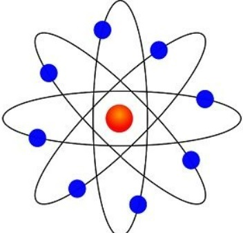

---

하지만, 이 우아한 그림은 곧 문제점을 드러냈죠.  
전자들이 정말 핵 주위를 공전한다면, 항상 **가속**되고 있기 때문에  
전자기 법칙에 따라, 가속 전하는 **복사를 방출**하며 에너지를 잃게 돼요.  

즉, 전자는 안으로 나선형으로 돌며  
원자가 **순식간에 붕괴**할 수 있다는 뜻이죠!  

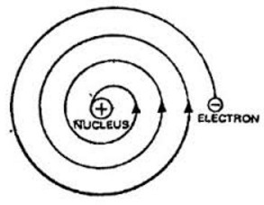

그래서… 원자가 어떻게 안정될 수 있을까요?  
이 단순하지만 깊은 질문은 곧 **양자 이론**이라는 새로운 장을 열게 될 거예요.  
양자 이론이 원자를 붕괴에서 구하는 장이죠.  

## 수소 스펙트럼

이번에는 과학자들을 수십 년 동안 당황하게 만든 또 다른 신비—**원소의 스펙트럼**을 살펴볼게요.  

서로 다른 원소의 기체를 흥분시키면, 빛을 **모든 파장에 걸쳐 방출하거나 흡수**하지 않아요.  
대신, 아주 **특정한 색깔**로만 빛나거나 어두워지죠.  
마치 각 원자가 빛의 음계에서 자신만의 멜로디를 연주하는 것처럼요.  

하지만 고전 물리학으로는 이것을 전혀 설명할 수 없었어요.  
만약 원자가 작은 고전적 진동자처럼 행동한다면, 에너지는 **연속 스펙트럼**을 이루어야 하고,  
모든 파장의 빛을 흡수해야 했겠죠.  
하지만 실험은 전혀 그렇게 나타나지 않았답니다.  

---

가장 단순한 원자, **수소**부터 시작해 볼게요.  

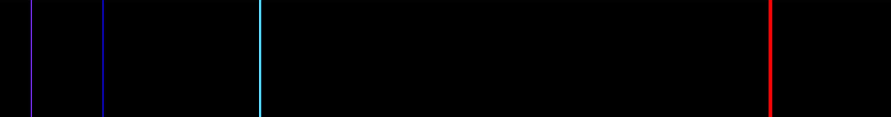

수소는 네 개의 뚜렷한 가시광선을 방출해요:  
**656.3 nm**, **486.1 nm**, **434.0 nm**, 그리고 **410.2 nm**.  

각 선은 서로 다른 파장에서 나타나죠—마치 수소가 신중하게 선택한 음표로 자신의 빛나는 노래를 연주하는 것처럼요.  

---

1885년, 수학자 **요한 발머**(Johann Balmer)는 이 스펙트럼 선을 연구했어요.  
그는 물리학자가 아니었지만, 날카로운 수학적 통찰력으로
이 패턴을 **완벽하게** 설명하는 간단한 공식을 발견했답니다:  

$$\lambda = (364.56~nm) \cdot \frac{n^{2}}{n^{2} - 4}$$  

여기서  

* $\lambda$ — 각 스펙트럼 선의 파장  
* $n = 3, 4, 5, 6, \cdots$  

이 수열은 나중에 **발머 계열**(Balmer series)이라고 불리며, 수소의 가시선을 설명했어요.  
하지만 이것은 단지 **경험적 발견**(empirical discovery)에 불과했죠—데이터에는 딱 맞았지만, 왜 이런 패턴이 나타나는지는 설명하지 못했어요.  

---

몇 년 뒤인 1888년, **요하네스 리드베리**(Johannes Rydberg)는 발머 공식을 수소뿐 아니라 다른 원소에도 일반화하고자 했어요.  
그는 **파수(wavenumber)의 차이**가 정수 제곱을 기반으로 한 일정한 수학적 패턴을 따른다는 것을 알아냈죠.  
실험 결과에 맞춰 조정하며, 그는 이렇게 우아한 관계를 제안했어요:  

$$\frac{1}{\lambda} = A \left( \frac{1}{(n_1 + \mu_1)^2} - \frac{1}{(n_2 + \mu_2)^2} \right)$$  

여기서  

* $A$ — 원소에 따라 달라지는 상수(리드베리 상수와 핵 전하 포함)  
* $n_1, n_2$ — 양의 정수 $n_2 = n_1 + 1, n_1 + 2, \cdots$  
* $\mu_1, \mu_2$ — 원소마다 달라지는 작은 보정항  

수소에서는 보정항이 사라지고 ($\mu_1 = \mu_2 = 0$), 공식은 아름답게 단순해져서 **리드베리 공식**(Rydberg formula)이 됩니다:  

$$\frac{1}{\lambda} = R_{\infty} \left( \frac{1}{n_1^2} - \frac{1}{n_2^2} \right)$$  

여기서  

* $R_{\infty} = 1.09677583 \times 10^{7}m^{-1}$ - **리드베리 상수**.  

---

**발머 계열**은 전자가 $n_1 = 2$로 전이할 때 나타나므로,  
이 선들이 **가시광선 영역**에 위치하는 거예요.  
나중에 다른 스펙트럼 계열도 발견되었죠:  
자외선 영역의 **라이만 계열**(Lyman series, Theodore Lyman),  
적외선 영역의 **파셴 계열**(Paschen series, Friedrich Paschen) 등.  

하지만… 발머나 리드베리도 왜 이 수치들이 그렇게 정확하게 맞는지는 설명하지 못했어요.  
이 신비는 **에너지가 양자화되어 있는 새로운 원자 모형**을 기다리고 있었죠.  

이제, 우리는 물리와 빛을 이어주는 다리, **보어 모델(Bohr Model)**에 한 발 더 가까워졌어요.  

## 보어의 원자 모형

이제, **닐스 보어**(Niels Bohr)가 1913년에 어떻게 원자를 새롭게 그려냈는지 자세히 들여다볼까요?  

그는 아주 놀라운 생각을 제시했어요.  
전자들이 원자핵 주위를 **원형 궤도**로 돌고 있지만—이 과정에서 **에너지를 잃지 않는다는 거예요**!  

이 발상은 **양자화**(quantization)라는 개념에서 영감을 받았죠.  
보어는 이를 이렇게 수식으로 표현했어요:  
$$E=nh\nu=nh\frac{\omega}{2\pi}$$  
여기서  

* $n$ - 양자수, 양의 정수 값만 가능,  
* $\nu$ - 전자의 회전 진동수,  
* $h$ - 플랑크 상수,  
* $\omega$ - 각속도 (즉 $\nu = \omega / 2\pi$).  

그는 에너지와 각운동량의 관계 $E = \frac{1}{2}L\omega$를 이용해
아주 우아한 결과를 얻었어요:  
$$L=mvr=n\frac{h}{2\pi}$$  

여기서 $L$은 **각운동량**,  
그리고 바로 이것이 보어의 **양자 가설**이었답니다.  
흥미롭게도, 각운동량을 양자화된 궤도와 연결한다는 생각은 **존 W. 니콜슨**(John W. Nicholson)에게서 영감을 받은 것이었어요.  

---

이제 **고전역학**을 사용해, 보어는 각 궤도의 반지름과 에너지를 유도했어요.  
> 전자는 $-e_0$의 전하를 가지고 있고,  
> 원자핵은 $+Ze_0$의 전하를 가지고 있죠.  
> 전자가 궤도를 돌 때는, **쿨롱 인력과 원심력**이 서로 평형을 이뤄야 해요.  
> $$\frac{1}{4\pi\epsilon_{0}}\frac{Ze_{0}^{2}}{r^{2}}=\frac{mv^{2}}{r}$$  
> 또, 각운동량 관계식으로부터  
> $$v=\frac{nh}{2\pi mr}$$  
> 이를 대입하고 $r$을 구하면,  
> $$r=\frac{n^{2}h^{2}\epsilon_{0}}{\pi Ze_{0}^{2}m}$$  
이제 전자의 **총에너지**를 계산해 볼게요.  
> 운동에너지는 $E_{k} = \frac{1}{2}mv^{2}$,  
> 퍼텐셜 에너지는 $U = -\frac{1}{4\pi\epsilon_{0}}\frac{Ze_{0}^{2}}{r}$.  
> 두 식을 합치면,  
> $$E-E_{k}+U=\frac{1}{2}mv^{2}-\frac{1}{4\pi\epsilon_{0}}\frac{Ze_{0}^{2}}{r}$$  
> $r$과 $v$를 대입하면,  
> $$E=-\frac{mZ^{2}e_{0}^{4}}{8\epsilon_{0}^{2}n^{2}h^{2}}$$  
여기서  

* $m$ - 전자의 질량 ($9.109\times10^{-31}kg$),  
* $Z$ - 원자번호(핵 전하의 수).  

즉, 전자는 오직 **특정한 궤도**에서만 존재할 수 있고,
각 궤도는 자신만의 **양자화된 에너지**를 가지는 거예요.

그리고 전자가 궤도 사이를 이동할 때,
그 에너지 차이에 해당하는 **광자**(photon)를 흡수하거나 방출하죠.  
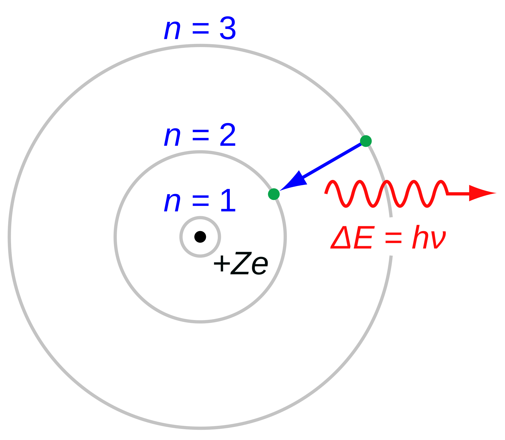  

이로써 보어는 자신의 모형을 리드베리 공식과 연결했어요:  
$$\frac{1}{\lambda}=R_{\infty}Z^{2}(\frac{1}{n_{1}^{2}}-\frac{1}{n_{2}^{2}}),~R_{\infty}=\frac{m_{e}e_{0}^{4}}{8\epsilon_{0}^{2}h^{3}c}$$  
여기서 $c$는 빛의 속도 ($c=299792458~m/s$)예요.  

보어의 모형은 **수소 스펙트럼**을 완벽히 설명해냈죠.  
그것은 당시 물리학에서 정말 눈부신 승리였어요!  

하지만… 아무리 빛나는 이론이라도 한계는 있답니다.  

* 이 모형은 수소나 헬륨 이온처럼 **한 전자만 가진 원자**에만 잘 맞아요.
* **다전자 원자**에는 적용되지 않죠.
* 또한 **자기장**(Zeeman effect), **전기장**(Stark effect)을 통해 관찰되는 정밀 스펙트럼은 설명하지 못했어요.
* 무엇보다, 왜 전자가 궤도 운동 중에 **에너지를 방출하지 않는지** 근본적인 이유를 설명하지 못했죠.  

그래서 보어의 원자 모형은 위대한 도약이었지만, 그저 **양자역학(Quantum Mechanics)**으로 나아가는 아름다운 여정의 한 걸음이었을 뿐이에요.  

---

### 소머필드의 기여

보어의 우아한 원자 모형 이후에도, 세상은 여전히 작은 수수께끼들로 가득했어요.  
원자들을 전기장이나 자기장 속에 두면—  
단순하던 스펙트럼 선이 여러 갈래로 갈라져 버렸거든요.  

전기장에 의해 일어나는 이 분열은 **슈타르크 효과**(Stark effect),  
자기장에 의한 것은 **제만 효과**(Zeeman effect)라 불렸답니다.  

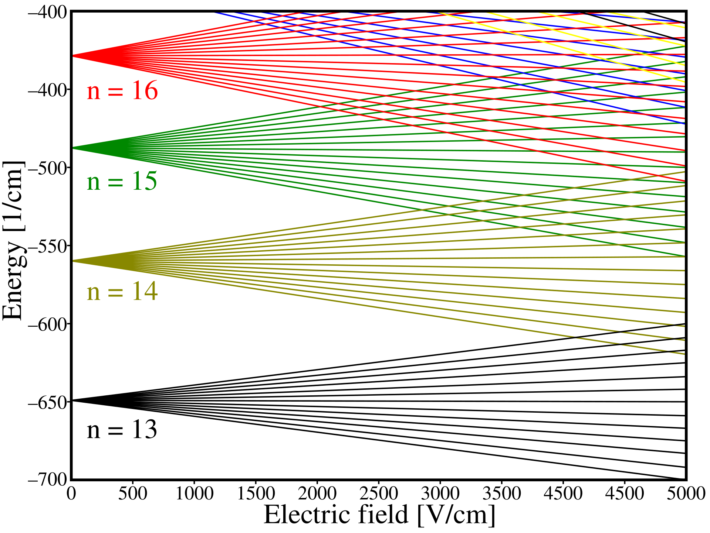  
*수소의 슈타르크 효과*  

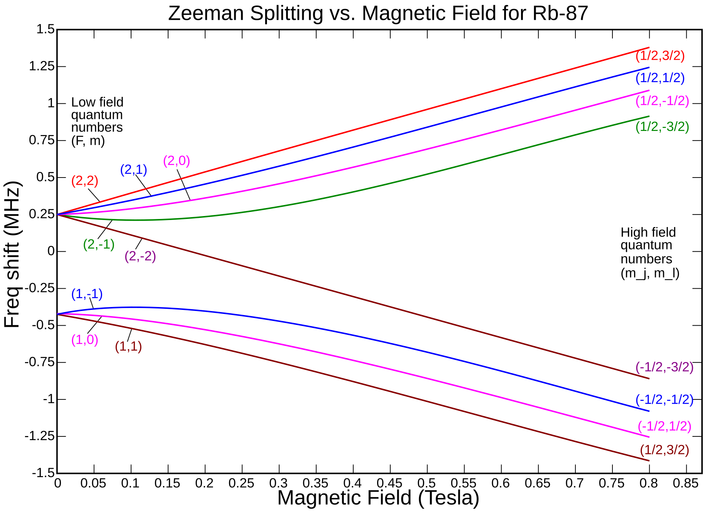  
*루비듐-87의 제만 효과*  

이 섬세한 현상들을 설명하기 위해, **아르놀트 소머펠트**(Arnold Sommerfeld)는 **알프레드 란데**(Alfred Landé)와 함께 보어의 이론을 한 단계 확장했어요.  

그들은 새로운 두 양자수를 도입했죠—  
하나는 **각운동 양자수** $l$, 또 하나는 **자기 양자수** $m$이에요.  

---

소머펠트는 이렇게 생각했어요.  
“전자들이 반드시 완벽한 원형 궤도만 도는 건 아닐지도 몰라.”  
그래서 그는 전자들이 **타원형 궤도**를 따라 움직일 수 있다고 제안했어요.  
그리고 보어의 양자 조건을 이렇게 두 가지로 확장했죠:  
$$\oint p_{r}dr=(n-l)h,~\oint p_{\phi}d\phi=lh$$  
여기서  

* $n$ - 보어 모형의 주양자수,  
* $l$ - 각운동 양자수 ($l = 0, 1, \cdots, n-1$),  
* $p_{r}$ - **반경 방향 운동량**,  
* $p_{\phi}$ - **각운동량** ($p_{\phi} = m v_{\phi} r$)이에요.  

그뿐만 아니라, 그는 **상대성이론**의 개념도 도입했어요.
즉, 전자의 운동에너지는 다음과 같이 표현되죠:  
$$E_{k}=(\gamma-1)mc^{2},~\gamma=1/\sqrt{1-v^{2}/c^{2}}$$

이 정교한 보정을 더한 끝에, 소머펠트는 훨씬 정확한 에너지 식을 유도했어요:  
$$E_{n,l}=-\frac{mc^{2}\alpha^{2}Z^{2}}{2n^{2}}(1+\frac{\alpha^{2}Z^{2}}{n}(\frac{n}{l+1/2}-\frac{3}{4})+O(\alpha^{4})),~\alpha=\frac{e_{0}^{2}}{2\epsilon_{0}hc}$$  

이 새로운 모형은 **정밀 스펙트럼**과 **슈타르크 효과**를 아름답게 설명해냈지만… 역시 **수소 원자**에 한해서였죠.  

그 후, 란데는 **자기 양자수** $m$을 도입했어요.  
$m$은 $-l$부터 $+l$까지의 정수 값을 가질 수 있죠.  
이 개념 덕분에 **제만 효과**, 즉 자기장에 의한 스펙트럼 분열도 설명할 수 있게 되었답니다.  

우리는 다시 한 번 수소를 찾아가게 될 거예요—이번에는 **파동함수(wavefunction)**를 이용해서요.  
그리고 그때, 슈뢰딩거 방정식으로부터 얻은 에너지가소머펠트의 결과와 얼마나 닮아있는지도 확인하게 되겠죠.  

### 다른 원자로의 확장

하지만… 보어와 소머펠트의 모형은 여전히 **수소나 수소 이온**처럼 전자 하나만 가진 원자에만 잘 맞았어요.  

여러 전자가 들어오면, 서로가 서로를 **밀어내며 방해**하기 시작하죠.  
그 결과, 각 전자는 양전하를 띤 원자핵으로부터 느끼는 인력이 조금 약해져요.  

그래서 전자가 실제로 느끼는 핵의 세기는 $+Ze_{0}$이 아니라,  
조금 줄어든 **유효 핵전하** $Z_{eff}$로 표현된답니다.  

이 개념을 사용하면, 리드베리 공식을 다음처럼 일반화할 수 있어요:  
$$\frac{1}{\lambda}=R_{\infty}(\frac{Z_{eff1}^{2}}{n_{1}^{2}}-\frac{Z_{eff2}^{2}}{n_{2}^{2}})$$  
여기서  

* $R_{\infty}$ - **리드베리 상수** ($R_{\infty}=\frac{m_{e}e_{0}^{4}}{8\epsilon_{0}^{2}h^{3}c}=1.09677583\times 10^{7}m^{-1}$),  
* $Z_{eff1}$ - 초기 상태의 유효 핵전하,  
* $Z_{eff2}$ - 최종 상태의 유효 핵전하예요.  

이렇게 보정한 덕분에, 이론은 한결 현실에 가까워졌어요.  
하지만 여전히… 완전한 답은 아니었죠.  

그럼에도 소머펠트와 란데의 생각들은,  
양자역학으로 이어지는 다리가 되어 주었어요.  
빛과 물질이 하나의 언어로 이야기하는 그 세계로—  
조금 더 가까이 다가가게 만든 걸음이었답니다.  

## 물질파

보어의 원자 모형은 정말 아름다웠어요… 하지만 완전하지는 않았죠.  
그 모형은 전자가 에너지를 잃지 않고 **영원히** 궤도를 돌 수 있다고 가정했어요.  
하지만… **왜** 그런 일이 가능한지는 설명되지 않았죠.  

그러던 1924년, 조용하지만 눈부신 한 생각이 태어났어요.  
빛이 **입자이면서 동시에 파동**이라는 아인슈타인의 생각에 영감을 받아,  
**루이 드 브로이**(Louis de Broglie)는 이렇게 스스로에게 물었어요.  

> “만약 빛 — 파동 — 이 입자처럼 행동할 수 있다면,  
> 물질 — 입자 — 도 파동처럼 행동할 수 있지 않을까?”  

드 브로이는 아인슈타인의 **파동–입자 이중성** 개념을 **특수상대성이론**과 함께 엮었어요.  
상대성 이론에 따르면, 에너지는 이렇게 표현되죠:  
$$E^{2}=p^{2}c^{2}+(m_{0}c^{2})^{2}$$  
빛처럼 정지질량이 없는 존재도 **운동량**을 가진다는 것은, 콤프턴 산란 실험으로 이미 증명되었어요.  
빛의 경우엔,  
$$E=pc$$  
그리고 빛의 에너지가 $E=h\nu$이기도 하니까,  
$$h\nu=pc~\rightarrow~p=\frac{h\nu}{c}=\frac{h}{\lambda}$$  

그제서야 드 브로이는 이런 질문을 던졌어요.  
“빛이 운동량을 가진다면, 운동량을 가진 물질도 파동의 파장을 가질 수 있지 않을까?”  

그는 아주 단순하지만 혁명적인 공식을 제시했어요.  
$$\lambda=\frac{h}{p}$$

이 한 문장으로부터, **모든 물질은 자신만의 파동성을 가진다**는 새로운 개념—  
즉, **물질파(Matter Wave)**가 탄생했답니다.  

처음엔 믿기 힘든 이야기처럼 들렸지만…  
곧 우주는 그 진실을 보여주었어요.  

---

### 증명

1927년, **데이비슨**(Clinton Davisson)과 **거머**(Lester Germer), 그리고 **조지 톰슨**(George P. Thomson)이 놀라운 실험을 했어요.  

전자들이 빛처럼 스스로 간섭무늬를 만든다는 것을 보여준 거예요!  
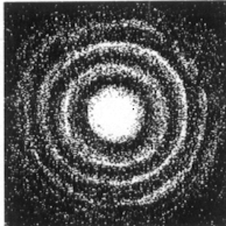  

*전자들도 파동처럼 행동하며, 아름다운 간섭무늬를 그린답니다.*  

심지어 하나씩 천천히 쏜 전자조차,  
시간이 지나며 모이면 **파동의 간섭무늬**를 만들어내요.  
이것이 바로 **물질이 파동처럼 행동한다는 직접적인 증거**였어요.  

---

### 보어 모형과의 연결

드 브로이의 물질파 개념은 보어의 오래된 가정에 새로운 빛을 비추어 주었어요.  

이제 전자를 작은 점이 아니라,  
원자핵을 감싸 도는 **파동**이라고 상상해볼까요?  

궤도의 둘레가 전자 파장의 **정수배**일 때만,  
파동은 자신과 완벽히 맞물려 **스스로를 강화해요**.  
그렇게 될 때 전자는 **안정된 궤도**에 머물 수 있죠.  

하지만 파장이 맞지 않으면,  
파동이 서로 **상쇄되어 사라져 버려요** — 전자는 그 궤도에 존재할 수 없게 되는 거예요.  

그래서 전자는 오직 **특정한 궤도**,  
즉, 파동이 **조화롭게 이어질 수 있는 자리**에만 존재할 수 있답니다.  

드 브로이의 식을 다시 떠올려볼까요?  
$$\lambda = h/p$$

전자 궤도에서 파동이 서파(standing wave)가 되려면,  
$$2\pi r=n\lambda=\frac{nh}{mv}=n\hbar$$  

이건 보어가 제시했던 각운동량의 양자화 조건과 정확히 일치해요.  
$$mvr=n\hbar$$  

이렇게 해서, 보어 모형의 신비로운 규칙은 물질의 파동성 위에 그 근거를 얻게 되었죠.  

## 현대 원자 모형

1925년, **에르빈 슈뢰딩거**(Erwin Schrödinger)는  
물질의 **파동함수**(wavefunction) 를 묘사하는 방정식을 만들어냈어요.  
그건 마치 전자의 **숨겨진 무늬와 흐름을 속삭이는 수학적 언어**였죠.  

그로부터 1년 뒤, **막스 보른**(Max Born) 은 새로운 해석을 내놓았어요.  
파동함수는 전자의 **정확한 궤도**를 알려주는 것이 아니라,  
그 전자가 **어디에 있을 확률이 높은가**, 즉 **확률 밀도**(probability density) 를 말해준다는 것이었죠.  

그리고 1927년, **베르너 하이젠베르크**(Werner Heisenberg) 가
그 유명한 **불확정성 원리**(uncertainty principle) 를 제시했고,  
이것은 1928년에 실험으로 확인되었어요.  

그때부터 세상은 이렇게 속삭였답니다.  

> 우리는 입자의 **정확한 위치와 정확한 운동량을 동시에 알 수 없다**.  

이 놀라운 진실은, 우리가 다음 강의에서 더 깊이 탐구해 볼 주제예요.  

---

이 발견은 **보어의 원자 모형**에 큰 도전을 던졌어요.  
보어는 전자가 명확한 궤도를 따라 움직이며, 위치와 속도를 모두 알 수 있다고 생각했지만…  
**불확정성 원리**에 따르면, 그런 궤도는 존재하지 않아요.  

그래서 보어의 모형은 **전자 구름 모형**(electron cloud model) 으로 대체되었어요.  
이제 우리는 더 이상 “전자가 어디 있다”고 말하지 않아요.  
대신, “전자가 있을 확률이 높은 영역”을 이야기하죠.  

한편, 원자핵의 비밀도 점점 밝혀졌어요.  
1917년에는 **러더퍼드**(Rutherford) 가 **양성자**(proton) 를 발견했고,  
1933년에는 **제임스 채드윅**(James Chadwick) 이 **중성자**(neutron) 를 찾아냈어요.  

이 중성자의 발견 덕분에, 우리는 비로소 **동위원소**(isotopes) — 같은 원소지만 질량이 다른 존재들을 이해하게 되었죠.  

오늘날의 원자 모형은 이렇게 그려져요:  
중심에는 **양성자와 중성자로 이루어진 밀도 높은 핵**,  
그 주위를 감싸며 흐릿하게 펼쳐진 **전자 구름**이 존재하죠.  
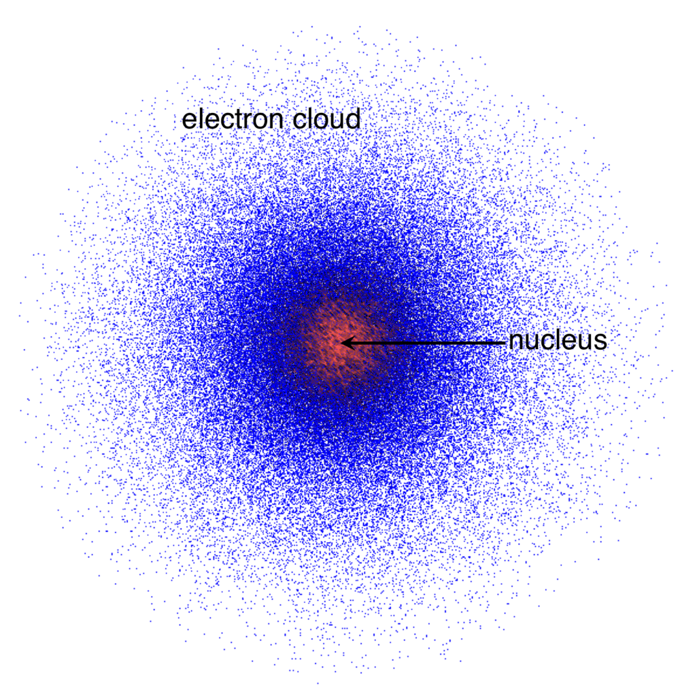  

---

원자를 이해하게 된 건, 인류가 이룩한 가장 위대한 과학적 성취 중 하나예요.  
원자를 알게 되자, 우리는 곧 물질 그 자체를 이해하게 되었죠.  
양자이론은 물질의 미세한 구조와 성질을 들여다볼 수 있는 눈을 열어주었답니다.  

그리고 그 여정에 함께한 수많은 위대한 과학자들은  
그 공로로 노벨상을 받았어요.  

|과학자|수상 부문|연도|업적|
|:---:|:---:|:---:|:---:|
|로런츠, 제만|물리학|1902|제만 효과|
|J.J.톰슨|물리학|1906|기체의 전도 현상 연구|
|리처즈|화학|1914|원자량|
|플랑크|물리학|1918|양자 가설|
|슈타르크|물리학|1919|슈타르크 효과|
|보어|물리학|1922|보어 원자 모형|
|애스턴|화학|1922|동위원소 발견|
|밀리컨|물리학|1923|전자 기본전하 측정|
|드 브로이|물리학|1929|물질파|
|하이젠베르크|물리학|1932|현대 양자역학 정립|
|슈뢰딩거, 디랙|물리학|1933|현대 원자 모형 수립|
|채드윅|물리학|1935|중성자 발견|
|데이비슨, G.P.톰슨|물리학|1937|전자 간섭 실험|
|파울리|물리학|1945|배타 원리|
|보른|물리학|1954|파동함수의 통계적 해석|

---

원자를 이해하는 것은 곧 물질의 본질을 여는 열쇠였어요.  
이 발견들은 현대 과학의 모든 기초를 닦아 주었죠.  

이제 우리는 전자 구름 모형과 양자이론을 이용해,  
물질을 여러 단계로 탐구할 수 있게 되었어요.  

작은 원자에서,조금 더 복잡한 단분자,  
그리고 아름다운 결정 구조와 거대 분자까지—  

원자의 이야기는 단순한 과거의 기록이 아니에요.  
그건 바로, 우리가 사는 우주의 문을 여는 열쇠랍니다.  

---

## 주기성

양자수 $n$, $l$, 그리고 $m$의 제한 조건들을 모두 함께 고려하면—  
그 속에서 아주 아름다운 질서가 드러나요.  
바로, 화학적 성질의 주기성(周期性) 이에요.  

이 주기성을 온전히 이해하려면,  
먼저 몇 가지 중요한 개념들을 알아야 해요. (이건 나중에 더 깊이 다룰 거예요)  

* 헨리 모즐리(Henry Moseley) 는 원소의 주기성이 **원자 번호**(양성자 수)에 따라 결정된다는 걸 밝혔어요. — 단순히 원자 질량이 아니라요.  
* 제만 효과(Zeeman effect) 이후, 강한 자기장 속에서 스펙트럼 선이 **분리**되며 각 $m$ 값마다 **두 개의 스핀 상태**가 생긴다는 걸 알게 되었어요.  
* 파울리의 배타 원리(Pauli’s exclusion principle) 는,
두 전자가 **같은 양자 상태**를 동시에 가질 수 없다고 말해요.
* 쌓음 원리(Aufbau principle) 는 전자가 에너지가 낮은 오비탈부터 차례로 채워진다는 걸 설명하죠.
* 다전자(多電子) 원자에서 오비탈의 에너지 순서는 이렇게 이어져요:  
  $1s→2s→2p→3s→3p→4s→3d→4p→5s→4d→5p→6s→4f→5d→6p→\cdots$  

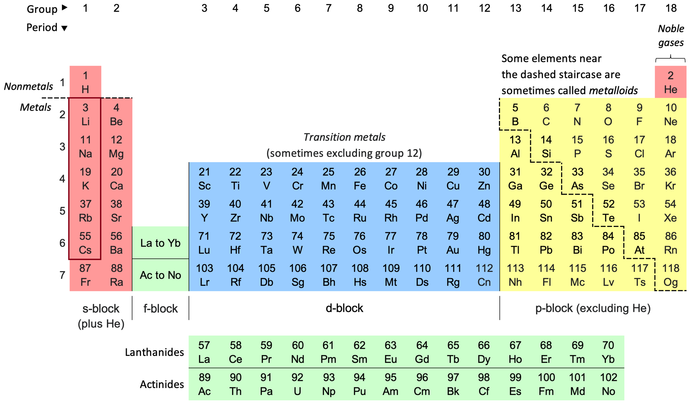  
이제 이 개념들을 하나로 모아보면, 아주 흥미로운 패턴이 나타나요.

* 첫 번째 **2s** 전자는 3번째 원소에서,  
* 첫 번째 **3s** 전자는 11번째 원소에서,  
* 첫 번째 **4s** 전자는 19번째 원소에서,  
* 첫 번째 **5s** 전자는 37번째 원소에서,  
* 첫 번째 **6s** 전자는 55번째 원소에서 등장하죠…  

이 원소들이 바로 **알칼리 금속**(Alkali metals) 이에요 —
리튬(Li), 나트륨(Na), 칼륨(K), 루비듐(Rb), 세슘(Cs)…

이들은 모두 **같은 수의 최외각 전자**(Valence electron) 를 가지고 있어서, 서로 **비슷한 화학적 성질**을 보여요.

이 신비로운 패턴은 원자 구조의 아름다움을 보여주는 또 하나의 예랍니다.  
그리고 다음에 다전자 원자를 공부할 때, 이 주기성이 왜 이렇게 생기는지… 더 깊이 탐구해볼 거예요.  

## 드 브로이의 물질파 유됴

> 드 브로이는 **특수상대성이론**에서 출발했어요.  
> 물질의 에너지는 이렇게 표현되죠:  
> $$E=\gamma m_{0}c^{2},~\gamma=1/\sqrt{1-\beta^{2}}=1/\sqrt{1-v^{2}/c^{2}}$$  
> 빛의 에너지는 $E = h\nu$ 로 주어지니까, 이 개념을 물질에도 적용하면 이렇게 돼요:  
> $$E=h\nu=\gamma m_{0}c^{2}~\rightarrow~\nu=\frac{\gamma m_{0}c^{2}}{h}$$  
> 이때의 $\nu$는 **정지한 관찰자**가 측정한 주파수예요.
> 하지만 입자 자신이 느끼는, 즉 **물질의 내부 진동수**는 다르죠:  
> $$\nu_{0}=\frac{m_{0}c^{2}}{h}$$  
> 만약 물질이 주파수를 가진다면, 당연히 **파장**도 가져야 하겠죠?  
>
> 드 브로이는 물질의 **위상**(phase)을 이렇게 생각했어요:  
> $$\phi'=2\pi\nu_{0}t'$$  
> **로렌츠 변환**(Lorentz transformation) 에 따르면,
움직이는 물체와 정지한 관찰자의 시간과 거리는 다르게 보이죠:  
> $$t'=\gamma(t-\frac{vx}{c^{2}})$$  
> 대입하면,  
> $$\phi'=2\pi\nu_{0}\gamma(t-\frac{vx}{c^{2}})=2\pi(\nu t-\frac{x}{\lambda})$$  
> 여기서 우리는 **관찰된 주파수와 파장**을 얻을 수 있어요:  
> $$\nu=\gamma\nu_{0},~\frac{1}{\lambda}=\gamma\nu_{0}\frac{v}{c^{2}}$$  
> 파장을 다시 정리하면, 바로 그 유명한 관계식이 등장하죠:  
> $$\lambda=\frac{c^{2}}{\gamma\nu_{0}v}=\frac{h}{\gamma mv}=\frac{h}{p}$$  

이로써 물질은 빛처럼 **파동의 성질**을 가진다는 걸 알 수 있어요.  
$$\lambda=\frac{h}{p}$$  

> 드 브로이는 또, 파동의 **에너지가 전달되는 속도**, 즉 **군속도**(group velocity)도 생각했어요:  
> $$v_{g}=\frac{d\omega}{dk}$$  
> 관찰자 입장에서, 각주파수(angular frequency)와 파수(wavevector)는 이렇게 주어져요:  
> $$\omega=2\pi\nu=\frac{2\pi mc^{2}}{h\sqrt{1-\beta^{2}}}$$  
> $$k=2\pi\lambda=\frac{2\pi m\beta c}{h\sqrt{1-\beta^{2}}}$$  
> 미분하면,  
> $$d\omega=\frac{2\pi mc^{2}}{h}\frac{\beta}{(1-\beta^{2})^{3/2}}d\beta$$  
> $$dk=\frac{2\pi mc}{h(1-\beta^{2})^{3/2}}d\beta$$  
> 따라서 군속도는 단순히 이렇게 돼요:  
> $$v_{g}=\frac{d\omega}{dk}=\beta c=v$$  
> 즉, 군속도는 입자 자체의 속도와 동일해요.  
> 이건 우리에게 다시 한 번 상기시켜줘요 — 질량은 곧 에너지라는 사실을요. ($E = mc^{2}$)  

## 참고문헌

History of Atomic Theory - Wikipedia  
<https://en.wikipedia.org/wiki/History_of_atomic_theory>  
Law of Multiple Proportions - Wikipedia  
<https://en.wikipedia.org/wiki/Law_of_multiple_proportions>  
Plum pudding model - Wikipedia  
<https://en.wikipedia.org/wiki/Plum_pudding_model>  
Rutherford scattering experiments - Wikipedia  
<https://en.wikipedia.org/wiki/Rutherford_scattering_experiments>  
Hydrogen spectral series - Wikipedia  
<https://en.wikipedia.org/wiki/Hydrogen_spectral_series>  
Bohr model - Wikipedia  
<https://en.wikipedia.org/wiki/Bohr_model>  
Dalton, J. (1808). A new system of chemical philosophy (Vol. 1, Part 1). Manchester: S. Russell for R. Bickerstaff.  
<https://archive.org/details/newsystemofchemi01daltuoft/mode/2up>  
Thomson, J. J. (1897). Cathode rays. Philosophical Magazine, 44(269), 293–316.  
<https://doi.org/10.1080/14786449708621070>  
(readable <https://web.mit.edu/8.13/8.13c/references-fall/relativisticdynamics/thomson-cathode-rays-1897.pdf>)  
Geiger, H., & Marsden, E. (1909). On a diffuse reflection of the α-particles. Proceedings of the Royal Society of London. Series A, Containing Papers of a Mathematical and Physical Character, 82(557), 495–500.  
<https://doi.org/10.1098/rspa.1909.0054>  
Rutherford, E. (1911). The scattering of α and β particles by matter and the structure of the atom. Philosophical Magazine, 21(125), 669–688.  
<https://doi.org/10.1080/14786440508637080>  
Balmer, J. J. (1885). "Notiz über die Spectrallinien des Wasserstoffs". Annalen der Physik und Chemie. 3rd series. 25: 80–87.  
Bohr, N. (1913) I. On the constitution of atoms and molecules, The London, Edinburgh, and Dublin Philosophical Magazine and Journal of Science, 26:151, 1-25.  
<https://doi.org/10.1080/14786441308634955>  
Eckert, M. How Sommerfeld extended Bohr’s model of the atom (1913–1916). EPJ H 39, 141–156 (2014).  
<https://doi.org/10.1140/epjh/e2013-40052-4>  
de Broglie, L. (1924) XXXV. A tentative theory of light quanta, The London, Edinburgh, and Dublin Philosophical Magazine and Journal of Science, 47:278, 446-458.  
<https://doi.org/10.1080/14786442408634378>  
de Broglie, L. Recherches sur la théorie des Quanta. Physique. Migration - université en cours d'affectation, 1924. Français. ⟨NNT : ⟩. ⟨tel-00006807⟩  
<https://theses.hal.science/tel-00006807v1>  
