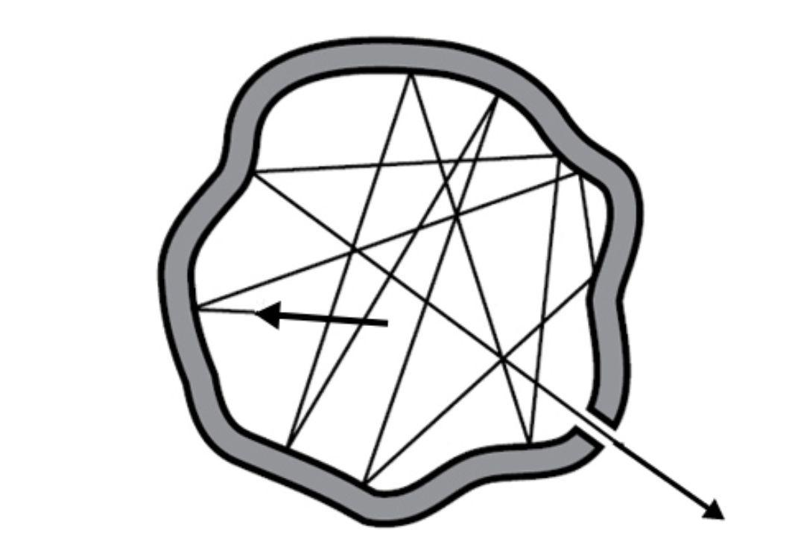

# 흑체복사

## 양자 화학: 서론

안녕하세요~ **화학 마스터리 나히다**예요.  
오늘은 *양자 화학(Quantum Chemistry)*의 첫 번째 이야기를 시작할 거예요.  
빛과 에너지도 아주 작은 세계의 신비로운 법칙을 따른다는 사실, 정말 흥미롭지 않나요?  

그런데 먼저, “양자(Quantum)”가 무엇인지 알아볼까요?  
혹시 들어본 적 있나요?  
왠지 미래 기술 같은 느낌이 들죠?  
예를 들어 *양자 컴퓨터*는 지금도 연구가 활발히 진행되고 있는 분야예요.  

그럼 ‘양자’라는 단어는 어디에서 왔을까요?  
영어 *quantity*(양, 수량)에서 유래된 말이에요.  
즉, *어떤 물리량의 가장 작은 단위*를 뜻하죠.  

이제부터 “양자”라는 개념이 어떻게 생겨났는지,  
그 흥미로운 과학의 여정을 함께 살펴봐요.  

## 플랑크 이전 (1900년 이전)

시간을 거슬러 19세기 말로 가볼까요?  
그때 물리학자들은 *빛과 온도* 사이의 관계를 이해하려고 노력하고 있었어요.  
그 연구의 중심에는 바로 **흑체 복사(Blackbody Radiation)**가 있었죠.  

**아이작 뉴턴 경**은 오래전에 이렇게 말했어요:  

> "Do not black Bodies conceive heat more easily from Light than those of other Colours do, by reason that the Light falling on them is not reflected outwards, but enters the Bodies, and is often reflected and refracted within them, until it be stifled and lost?"  
>
> "다른 색깔의 물체보다 검은 물체가 빛으로부터 열을 더 쉽게 받아들이는 것은 아닐까? 그 물체에 떨어지는 빛이 밖으로 반사되지 않고 물체 안으로 들어와 종종 반사되고 굴절되어 결국 억제되고 사라지기 때문일까?"  

검은 물체는 모든 빛을 흡수하지만, 에너지는 사라지지 않아요. 그럼 그 에너지는 어디로 갈까요?  

1858년, **밸푸어 스튜어트(Balfour Stewart)**는 흑체가 에너지를 가장 강하게 흡수하고, 또 가장 강하게 방출한다는 사실을 발견했어요.  
이듬해 **구스타프 키르히호프(Gustav Kirchhoff)**는 흑체의 복사 스펙트럼이 물질의 종류가 아닌 *온도*에만 의존한다고 밝혔답니다.  

그 뒤로 여러 과학자들이 흑체의 빛을 수학으로 표현하려 했어요.  
그중 **빌헬름 빈(Wilhelm Wien)**의 식이 실험과 잘 맞았죠:  

**빈의 법칙 (1896)**  
$$u(\nu,T)=a\nu^{3}e^{-b\nu/T}$$  
$u$: 단위 주파수당 에너지 밀도  
$\nu$: 주파수  
$T$: 온도  
$a, b$: 상수  

1900년, **레일리 경(Lord Rayleigh)**는 고전적인 관점에서 또 다른 식을 제시했어요.  

**레일리–진스 법칙 (1900)**  
$$du(\nu,T)=\frac{8\pi\nu^{2}kT}{c^{3}}d\nu$$  
$c$: 빛의 속도 ($c=2.99792458\times10^{8}~m/s$)  
$k$: 볼츠만 상수 ($k=1.380649×10^{−23}~J/K$)  

하지만… 문제가 생겼어요.  
이 식은 주파수가 높아질수록 에너지가 *무한대*가 된다고 예측했죠.  
이것이 바로 악명 높은 **자외선 파탄(Ultraviolet Catastrophe)**이에요.  
  
즉, 저주파에서는 레이리–진스 법칙이 맞고, 고주파에서는 빈의 법칙이 맞지만, 그 사이를 완벽히 설명할 수 있는 식은 없었답니다.  

---

## 양자 물리학의 탄생

1900년 12월, **막스 플랑크(Max Planck)**는 새로운 길을 열었어요.  
그는 이렇게 생각했죠: “에너지가 연속적인 게 아니라, 작은 단위로 나누어진다면 어떨까?”  
그가 바로 **양자(quantum)**의 개념을 세상에 처음 제시했어요.  

**플랑크의 양자 가설 (Quantum Hypothesis)**  
$$E=n\epsilon=nh\nu$$  
$\epsilon$: 한 개의 에너지 단위(양자)  
$h=6.62607015\times10^{-34}~J\cdot s$: 플랑크 상수  
$\nu$: 주파수  

즉, 빛의 에너지는 연속적인 값이 아니라  
$h\nu$의 정수배로만 존재한다는 뜻이에요.  
이 생각이 바로 **양자 물리학의 시작점**이 되었답니다.  

## 플랑크의 법칙

플랑크는 **볼츠만 분포**를 이용해  
이 작은 에너지들이 온도에 따라 어떻게 분포되는지를 계산했어요.  

**볼츠만 분포식**  
$$f(E)\propto e^{\frac{E}{kT}}$$  
$f(E)$: 에너지 E를 갖는 분자의 개수  
$E$: 특정 앙상블에서의 에너지  
$k$: 볼츠만 상수  
$T$: 온도  

이로부터 평균 에너지를 구할 수 있어요. 다만, 이는 플랑크가 아니라 1924년 보스와 아인슈타인이 제안한 방법이에요.  
$$<E>=\frac{h\nu}{e^{h\nu/kT}-1}$$  

이 값을 이용해 얻은 식이 바로 **플랑크의 복사 법칙**이에요.  

**플랑크 법칙 (주파수 형태)**  
$$du(\nu,T)=\frac{8\pi h\nu^{3}}{c^{3}}\cdot\frac{1}{e^{h\nu/kT}-1}d\nu$$  

**플랑크 법칙 (파장 형태)**  
$$du(\lambda,T)=\frac{8\pi hc}{\lambda^{5}}\cdot\frac{1}{e^{hc/\lambda kT}-1}d\lambda$$  

이제야 빈의 식과 레일리–진스 식을 하나로 연결하는 아름다운 조화가 완성된 거예요.  

## 플랑크 법칙의 검증

이제 우리가 얻은 이 아름다운 수식이 정말로 옳은지, 실험 결과와 비교해볼 차례예요.  
좋은 이론이라면 반드시 관찰된 사실과 일치해야 하니까요.  

플랑크의 복사 법칙은 두 가지 이미 알려진 경험 법칙을 완벽하게 설명합니다.  

**스테판-볼츠만 법칙 (1877)**  
*복사 에너지는 온도의 4제곱에 비례한다.*  
$$M=\sigma T^{4}$$  
**빈의 변위 법칙 (1896)**  
*복사 스펙트럼의 최대 세기가 나타나는 파장은 온도에 반비례한다.*  
$$\lambda_{peak}=\frac{b}{T}$$  

두 식이 플랑크의 법칙에서 어떻게 유도되는지 볼까요?  

### 스테판–볼츠만 법칙

플랑크의 법칙을 모든 주파수에 대해 적분하면,  
흑체가 방출하는 **총 복사 에너지**를 구할 수 있습니다.  

> $$\int du=\int_{0}^{\infty}\frac{8\pi h\nu^{3}}{c^{3}}\cdot\frac{1}{e^{h\nu/kT}-1}d\nu$$  
> 계산을 단순화하기 위해 $x=h\nu/kT$라 두면, $dx=hd\nu/kT$가 됩니다.  
> $$\int_{0}^{\infty}\frac{8\pi k^{3}T^{3}}{h^{2}c^{3}}\cdot\frac{x^{3}}{e^{x}-1}\cdot\frac{kT}{h}dx$$  
> 알려진 적분 결과는 다음과 같습니다.  
> $$\int_{0}^{\infty}\frac{x^{3}}{e^{x}-1}dx=\frac{\pi^{4}}{15}$$  
> 따라서,  
> $$E=\int du=\frac{8\pi k^{3}T^{3}}{h^{2}c^{3}}\cdot\frac{\pi^{4}}{15}\cdot\frac{kT}{h}=\frac{8\pi^{5}k^{4}T^{4}}{15h^{3}c^{3}}$$  

이로써 흑체의 **총 복사 에너지**를 구했습니다.(단위: $J/m^{3}$) 하지만 **스테판–볼츠만 법칙**은 *복사 세기(radiation power)*, 즉, 단위 면적당 복사 에너지(단위: $W/m^{2}$)를 다룹니다.  
총 에너지에서 표면 복사로 변환하기 위해 $c/4$를 곱하면,  

> $$M=E\cdot\frac{c}{4}=\frac{8\pi^{5}k^{4}T^{4}}{15h^{3}c^{3}}\cdot\frac{c}{4}=\frac{2\pi^{5}k^{4}T^{4}}{15h^{3}c^{2}}=\sigma T^{4}$$  

따라서,  

**스테판–볼츠만 법칙**  
$$M=\sigma T^{4}=\frac{2\pi^{5}k^{4}}{15h^{3}c^{2}}T^{4}$$  
$$\sigma=\frac{2\pi^{5}k^{4}}{15h^{3}c^{2}}=5.67\times10^{-8}~W/m^{2}\cdot K^{4}$$  
이 상수 $\sigma$는 실험 결과와도 매우 잘 일치합니다.  

### 빈의 변위 법칙

**빈의 변위 법칙**은 어떤 파장(또는 주파수)에서 복사 에너지가 최대가 되는지를 알려줍니다.  

> $$\frac{d(du/d\lambda)}{d\lambda}=0$$  
> 플랑크의 법칙은 파장에 대해 이렇게 쓸 수 있습니다.  
> $$\frac{du(\lambda,T)}{d\lambda}=\frac{8\pi hc}{\lambda^{5}}\cdot\frac{1}{e^{hc/\lambda kT}-1}$$  
> 식을 단순화하기 위해 $\lambda=hc/xkT$로 두면, $d\lambda=-hcdx/x^{2}kT$가 됩니다.  
> $$du(x,T)=-\frac{8\pi x^{5}k^{5}T^{5}}{h^{4}c^{4}}\cdot\frac{1}{e^{x}-1}dx$$  
> 이제, 이 식이 최대가 되는 $x$를 찾아야 합니다.  
> $$\frac{d}{dx}\!\left(\frac{x^{5}}{e^{x}-1}\right)=\frac{5x^{4}(e^{x}-1)-x^{5}e^{x}}{(e^{x}-1)^{2}}=0$$  
> 계산을 통해 얻을 수 있는 값은  
> $$x=\frac{hc}{\lambda kT}\approx4.9651$$  
> 이 관계를 정리하면,  
> $$\lambda_{peak}=\frac{b}{T}\approx\frac{hc}{4.9651kT}=\frac{2.90~mm/K}{T}$$  

즉, 온도가 높을수록 복사 세기가 가장 강한 파장은 짧아집니다.  

**빈의 변위 법칙**  
$$\lambda_{peak}=\frac{b}{T}\approx\frac{hc}{4.9651kT}=\frac{2.90~mm/K}{T}$$  

따라서, 온도가 오를수록 물체는 더 짧은 파장에서 빛나며 붉은색 → 노란색 → 푸른색으로 변화해요.  

### $\nu \rightarrow 0$

**레일리–진스 법칙**은 저주파 영역에서의 복사를 잘 설명합니다.  
따라서 주파수 $\nu$가 작을 때, 플랑크의 법칙은 레이리–진스 법칙으로 수렴해야 합니다.  

> $$\lim_{\nu\rightarrow0}du(\nu,T)=\lim_{\nu\rightarrow0}\frac{8\pi h\nu^{3}}{c^{3}}\cdot\frac{1}{e^{h\nu/kT}-1}d\nu$$  
> 알려진 극한식은 다음과 같습니다.  
> $$\lim_{x\rightarrow0}\frac{e^{x}-1}{x}=1$$  
> 따라서,  
> $$\lim_{\nu\rightarrow0}\frac{8\pi h\nu^{3}}{c^{3}}\cdot\frac{1}{e^{h\nu/kT}-1}d\nu=\frac{8\pi kT\nu^{2}}{c^{3}}d\nu$$  

즉, 주파수가 작을 때 플랑크의 법칙은 자연스럽게 **레일리–진스 법칙**으로 수렴합니다.  

### $\nu \rightarrow \infty$

반면 **빈의 법칙**은 고주파 영역에서 실험과 잘 맞습니다.  
따라서 주파수가 아주 클 때, 플랑크의 법칙은 빈의 법칙으로 수렴해야 합니다.  

> $$\lim_{\nu\rightarrow\infty}du(\nu,T)=\lim_{\nu\rightarrow\infty}\frac{8\pi h\nu^{3}}{c^{3}}\cdot\frac{1}{e^{h\nu/kT}-1}d\nu$$  
> 지수 함수는 매우 빠르게 증가하므로, $e^{h\nu/kT}-1 \approx e^{h\nu/kT}$로 근사할 수 있습니다.  
> $$\lim_{\nu\rightarrow\infty}\frac{8\pi h\nu^{3}}{c^{3}}\cdot\frac{1}{e^{h\nu/kT}-1}d\nu=\frac{8\pi h\nu^{3}}{c^{3}}\cdot e^{-h\nu/kT}d\nu=a\nu^{3}e^{-b\nu/T}$$  

따라서, 고주파 영역에서 플랑크의 법칙은 **빈의 법칙**과 거의 동일한 형태를 보입니다.  

---
---

## 플랑크의 생각과 통찰

### 1900년 10월 — 두 법칙의 조화

플랑크는 **빈의 법칙**과 **레일리–진스 법칙**이  
각자 자신들의 영역에서는 잘 맞지만, 서로 다른 범위에서만 성립한다는 점에 주목했어요. 그는 이렇게 생각했죠.  
> “혹시 이 두 법칙이 모두, 더 깊은 하나의 진리를 다른 방식으로 표현한 건 아닐까?”

그는 열역학과 엔트로피 개념을 이용해 두 법칙을 매끄럽게 이어주는 새로운 접근법을 찾기 시작했어요.  

> **빈의 법칙**에서는 에너지가 주파수와 온도의 지수 함수로 표현됩니다.  
> 반면 **레일리–진스 법칙**에서는 에너지가 온도 자체에 비례합니다.  
> $$U_{Wien}\propto \nu e^{-b\nu/T}~(Wien)$$  
> $$U_{RJ}\propto T~(RJ)$$  
> 플랑크는 이 문제에 열역학을 적용했어요. 그 기본식은 다음과 같습니다.  
> $$dU=TdS-PdV$$  
> 실험은 아주 작은 구멍이 뚫린 상자 안에서 진행되었으므로, 부피 변화는 없습니다.  
>   
> 따라서 열역학식은 다음처럼 단순화됩니다.  
> $$dU=TdS,~\frac{\partial S}{\partial U}=\frac{1}{T}$$  
> 플랑크는 두 법칙에 대해 ${\partial S}/{\partial U}$의 형태를 비교했습니다.  
> $$\frac{\partial S}{\partial U}=\frac{1}{T}\propto \ln(U)~(Wien)$$  
> $$\frac{\partial S}{\partial U}=\frac{1}{T}\propto\frac{1}{U}~(RJ)$$  
> 이 식을 한번 더 미분해볼까요?  
> $$\frac{\partial^{2} S}{\partial U^{2}}\propto\frac{1}{U}~(Wien)$$  
> $$\frac{\partial^{2} S}{\partial U^{2}}\propto\frac{1}{U^{2}}~(RJ)$$  
> 이렇게 하면 $(\partial^{2} S/\partial U^{2})^{-1}$을 에너지 $U$의 다항식으로 쓸 수 있습니다.  
> $$(\frac{\partial^{2} S}{\partial U^{2}})^{-1}\propto U~(Wien)$$  
> $$(\frac{\partial^{2} S}{\partial U^{2}})^{-1}\propto U^{2}~(RJ)$$  
> 플랑크는 이 두 형태를 결합하여 다음의 일반식을 제안했습니다.  
> $$(\frac{\partial^{2} S}{\partial U^{2}})^{-1}=C_{1}U+C_{2}U^{2}$$  
> 그리고 그 결과, 파장에 관한 식의 형태를 이렇게 정리했어요.  
> $$U=\frac{C\lambda^{-5}}{e^{c/\lambda T}-1}$$  

### 1900년 12월 — 불연속적인 에너지

그해 말, 플랑크는 **볼츠만의 엔트로피 이론**을 복사 현상에 적용했습니다.  
그는 상자 속의 공간을 수많은 작은 “에너지 조각(energy elements)”으로 상상했어요.  

$$\epsilon\epsilon\epsilon|\epsilon\epsilon|\epsilon|\epsilon\epsilon\epsilon|\epsilon\epsilon|\cdots$$  

여기서 $\epsilon$은 하나의 에너지 단위(quantum)입니다.  

그는 이 작은 에너지들이 가질 수 있는 모든 배열의 경우의 수를 계산했습니다.  

$$W=\frac{(P+N-1)!}{P!(N-1)!}$$  
$P=UN/\epsilon$: 에너지 입자의 수,  
$U$: 빛 하나의 평균 에너지,  
$N$: 빛의 파동(모드)의 개수.  

> $N$의 값은 매우 크므로 $N-1 \approx N$으로 근사할 수 있습니다.  
> 또, $n$이 충분히 크면 계승은 다음과 같이 근사됩니다.  
> $$n!\approx\sqrt{2\pi n}(n/e)^{n}~(n\rightarrow\infty)$$  
> $n^{n}$은 $\sqrt{n}$보다 훨씬 크므로, $W$는 이렇게 쓸 수 있습니다.  
> $$W=\frac{(P+N-1)!}{P!(N-1)!}\approx \frac{(P+N)^{P+N}}{P^{P}N^{N}}$$  

그다음 플랑크는 **볼츠만의 엔트로피 관계식**을 사용했습니다.  

$$S=k\ln(W)$$  

여기서  
$S$: 계의 절대 엔트로피  
$W$: 가능한 미시 상태의 수 (*Wahrscheinlichkeit*, “확률”)  

> 열역학의 기본식을 다시 떠올려봅시다.  
> $$\frac{1}{T}=\frac{\partial S}{\partial U}=k\frac{\partial(\ln W)}{\partial U}$$  
> 우리는 $W$의 근사식을 구했으므로, $\ln(W)$를 다음과 같이 쓸 수 있습니다.  
> $$\ln(W)=(P+N)\ln(P+N)-P\ln(P)-N\ln(N)=\frac{N}{\epsilon}((U+\epsilon)\ln(U+\epsilon)-\epsilon\ln(\epsilon)-U\ln(U))$$  
> 따라서,  
> $$k\frac{\partial(\ln W)}{\partial U}=\frac{kN}{\epsilon}(\ln(U+\epsilon)-\ln(U))$$  
> 단일 에너지 입자에 대한 엔트로피는  
> $$\frac{k}{\epsilon}(\ln(U+\epsilon)-\ln(U))=\frac{1}{T}$$  
> 이 식을 정리하면,  
> $$U=\frac{\epsilon}{e^{\epsilon/kT}-1}=\frac{h\nu}{e^{h\nu/kT}-1}$$  

이로부터 역사적인 결과가 태어났습니다.  

$$U=\frac{\epsilon}{e^{\epsilon/kT}-1}=\frac{h\nu}{e^{h\nu/kT}-1}$$  

이것이 바로 **플랑크의 유명한 식**이에요. 각 빛의 파동은 $h\nu$의 정수배 에너지만 가질 수 있습니다.  
즉, 에너지는 연속적인 것이 아니라, **불연속적인 양자(quanta)**로 구성되어 있다는 뜻이죠.  

플랑크는 에너지 양자를 발견한 공로로 **1918년 노벨 물리학상**을 받게 되요.  

> *1918년 노벨 물리학상은 "에너지 양자를 발견하여 물리학 발전에 기여한 공로"로 막스 카를 에른스트 루트비히 플랑크에게 수여되었습니다.*  

그 순간, 인류는 처음으로 **양자 세계의 문턱**을 넘어섰습니다.  
그때 과학의 밤하늘에, 아주 작고 고요한 **지식의 빛**이 떠올랐어요.  
이것이 바로 **양자 시대의 여명**, 우주에서 가장 작은 비밀을 향한 인류의 첫걸음이었습니다.  

## 참고문헌

Blackbody Radiation: Wikipedia (<https://en.wikipedia.org/wiki/Blackbody%20Radiation>)  
Planck's Law: Wikipedia (<https://en.wikipedia.org/wiki/Planck%27s%20Law>)  
Planck, M. (1900). Über eine Verbesserung der Wien’schen Strahlungsgleichung. *Verhandlungen der Deutschen Physikalischen Gesellschaft*.  
Planck, M. (1900). Zur theorie des gesetzes der energieverteilung im normalspektrum. *VhDPG*, 2, 238.  
