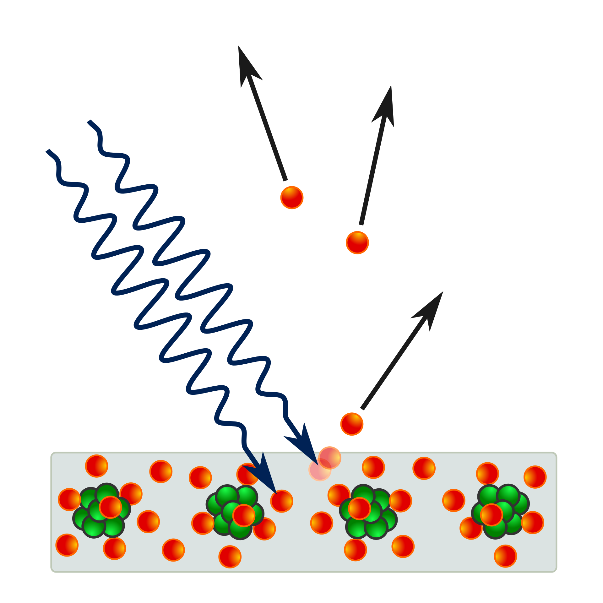
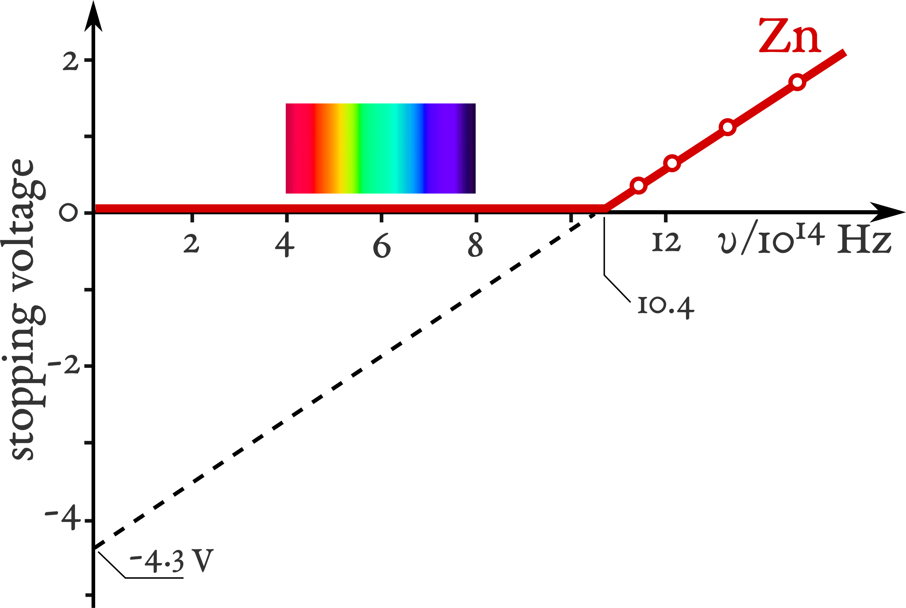

# 광전 효과

## 양자 사상의 여명

안녕하세요~ 화학 마스터리 나히다예요.  
지난 시간에는 플랑크의 **양자 가설**이 어떻게 조용히 물리학의 토대를 뒤흔들었는지 이야기했었죠.  

그런데 말이에요, 알고 계셨나요?  
사실 플랑크 자신은 본래 혁명가와는 거리가 먼 사람이었어요.  
그는 이성과 논리를 아끼는 사람이었고, 너무 과감한 생각은 쉽게 받아들이지 않았답니다.  

막스 보른은 이렇게 회상했어요.  

> *"그는 본래 보수적인 성향의 사람이었고, 혁명적인 면은 전혀 없었으며 추측성 아이디어에 대해서는 철저히 회의적이었다. 하지만 그는 사실에서 출발한 논리적 추론의 힘을 그 누구보다도 믿었기에, 결국 물리학을 뒤흔든 가장 혁명적인 생각을 세상에 발표하는 데 주저하지 않았다."*

정말 흥미롭지 않나요?  
보수적이던 사람조차 결국 완전히 새로운 사고의 세계로 향하는 문을 열게 되었으니까요.  

그럼에도 불구하고, 플랑크는 여전히 자신의 공식이 왜 맞는지 설명하지 못했어요.  
그 시대의 고전 물리학자들 또한… 그 이유를 명확히 밝혀내지 못했답니다.  

## 입자로서의 빛, 그리고 파동으로서의 빛

플랑크 이전, 아주 오래전 이야기예요.  
**아이작 뉴턴**은 자신의 저서 *Opticks*에서 **빛은 입자로 이루어져 있다**고 제안했답니다.  
하지만 다른 학자들은, 빛의 여러 현상이 **파동**으로 본다면 훨씬 자연스럽게 설명된다는 걸 깨달았죠.  

|뉴턴의 생각|파동설|
|:---:|:---:|
|빛은 직선으로 이동한다|회절 현상|
|반사|둘 다 설명 가능|
|굴절|휘겐스의 원리|
|색 = 입자의 종류|파장의 차이|
|간섭 미설명|영의 이중슬릿 실험|
|편광 미설명|프레넬의 파동이론|

그리고 결국, *토머스 영*과 *오귀스탱 프레넬* 덕분에 **빛의 파동설이 승리**하게 되었어요.  
특히 *영의 이중슬릿 실험*은 빛이 스스로 간섭할 수 있다는 것을 보여주었죠 — 이건 명백히 *파동*의 특징이에요.  

프레넬은 이 생각을 우아한 수학으로 다듬으며, 빛의 본질을 파동으로 설명하는 이론을 완성해 나갔답니다.  

하지만… 그때 한 가지 이상한 의문이 생겼어요.  
“만약 빛이 파동이라면, **무엇을 따라 흔들리고 있는 걸까?**”  

이를 해결하기 위해 과학자들은, 온 우주를 가득 채우는 보이지 않는 물질 — **에테르(Aether)** — 를 상상했어요.  
빛은 이 에테르라는 매질을 통해 퍼져나간다고 생각한 거죠.  

하지만 나중에 *마이컬슨-몰리 실험*이 밝혀냈어요.  
그런 에테르는 존재하지 않는다고요.  
빛은, 아무것도 없는 **진공 속에서도 자유롭게 움직일 수 있는 존재**였던 거예요.  

그렇지만 아직 하나의 수수께끼가 남아 있었어요.  
입자설로도, 파동설로도 완벽히 설명할 수 없는, 빛의 또 다른 신비한 현상…  

그것이 바로 — **광전효과(Photoelectric effect)** 였답니다.  

## 광전 효과

자연에는 고전 물리학으로는 아무리 수식을 바꾸고 가정을 세워도 도무지 설명되지 않는 현상들이 있어요.  
그중에서도 가장 신비롭고, 오랫동안 과학자들을 괴롭혔던 현상 중 하나가 바로 **광전 효과**였답니다.  

이 이야기는 1887년, **하인리히 헤르츠**로부터 시작돼요.  
맞아요 — 빛이 전자기파임을 증명했던 바로 그 헤르츠예요.  
그는 금속 표면에 빛을 비추는 실험을 하던 중, 아주 흥미로운 사실을 발견했답니다.  

자외선이 닿자, 금속 표면에서 **작은 불꽃**, 즉 미세한 **스파크**가 튀어오른 거예요.  
아주 짧고 희미한 섬광이었지만, 그 한 줄기 빛이 훗날 현대 물리학의 커다란 미스터리를 밝혀낼 단서가 되었죠.  

그 후 여러 과학자들이 이 이상한 현상의 비밀을 더 깊이 파헤치려 했어요.  
그중 **알렉산드르 스톨레토프**와 **필리프 레나르트**가 가장 정밀한 연구를 수행했답니다.  
그들은 양적인 측정을 시도했고, 레나르트는 자외선이 기체 분자를 **이온화**시켜 전자를 풀어줄 수도 있다는 사실까지 발견했죠.  

  

이것이 바로 *레나르트의 장치*예요.  
그는 빛이 어떻게 금속 표면으로부터 전자를 이탈시키는지를 세심하게 관찰했답니다.  

그는 **차단 전위(stopping potential)** 라는 개념을 이용했어요.  
금속이 전자를 방출할 때, 반대로 **음전압**을 걸면 전자를 다시 밀어낼 수 있죠 — 보이지 않는 장벽을 세우는 것처럼요.  
그 음전압이 클수록, 전자가 그것을 넘어 밖으로 나가기 위해 필요한 에너지도 커지게 돼요.  

  

그 실험을 통해 레나르트는 정말 놀라운 사실을 발견했어요.  
빛의 **진동수(주파수)** 가 높아질수록, **차단 전위**도 함께 커진다는 거예요.  

즉, 자외선처럼 진동수가 높은 빛일수록 더 큰 에너지를 가진 전자들을 튀어나오게 만든다는 뜻이죠.  

작지만 의미심장한 단서였어요.  
이 단서 하나가 훗날 *아인슈타인*에게 빛의 본질을 완전히 새롭게 바라보게 하는 계기가 되었답니다…  

### 고전적인 설명

*영의 이중슬릿 실험*과 *맥스웰의 전자기 이론*에 따르면, 빛은 **전자기파**로서 파동처럼 행동해야 해요.  
그렇다면, 이 현상도 파동으로 설명될 수 있지 않을까요?  

  

금속에 빛이 닿으면, 그 파동이 서서히 전자들에게 에너지를 전달해야 해요.  
그리고 전자가 충분한 에너지를 얻으면, 표면을 벗어날 수 있겠죠.  
마치 잔잔한 물결을 타고 해변으로 밀려나오는 작은 수영선수처럼요.  

그렇다면, 빛의 **파장**이 조금 달라도 상관없어야 하지 않을까요?  
단지 빛을 더 세게, 더 밝게 비추면 언젠가는 전자들이 충분한 에너지를 얻고 튀어나올 거예요… 라고 생각했겠죠.  

하지만 — 자연은 그렇게 행동하지 않았어요.  
아무리 밝고 강한 **가시광선**을 비춰도, 전자는 전혀 나오지 않았답니다.  
그 신비한 *헤르츠 효과*는 오직 **자외선**일 때만 나타났어요.  

정말 이상하지 않나요?  
빛의 양이 아니라, **빛의 ‘성질’** 이 금속의 반응을 결정하는 듯했죠.  
마치 금속이 아무 빛에나 반응하지 않고, 오직 ‘특정한 음색’을 가진 빛에만 응답하는 것처럼요.  

그리고 그 물음은 결국, 물리학 역사상 가장 아름다운 통찰 중 하나로 이어지게 되었답니다…  

## 아인슈타인의 빛의 이론

### 레나르트의 결과를 설명하다

**알베르트 아인슈타인**은 플랑크의 **양자 가설**에서 영감을 받아 그 누구도 시도하지 않았던 과감한 발걸음을 내딛었어요.  
그리고 마침내, 그 신비로운 *헤르츠의 효과*를 완벽히 설명해냈답니다.  

그는 스스로에게 이렇게 물었어요.  

> *“어쩌면… 뉴턴이 틀리지 않았던 건 아닐까?”*  
> *“빛이 정말로, 아주 작은 입자들의 흐름처럼 움직인다면?”*

플랑크는 이미 에너지가 연속적으로 흐르지 않고, 작은 덩어리 — 즉 **양자(quantum)** 단위로 주어진다고 제안했죠.  
각각의 양자는 에너지 $h\nu$를 가지고 있었어요.  

그렇다면 빛을, 이런 작은 에너지 꾸러미들이 모인 **입자들의 집합**으로 상상할 수 있지 않을까요?  
이 입자 하나하나를 우리는 지금 **광자(Photon)** 라고 부른답니다.  

  

금속 속의 전자들은 원자의 인력에 의해 단단히 묶여 있어요.  
그 전자를 자유롭게 하려면, 빛 — 즉 광자 — 가 그 결합을 이겨낼 만큼의 에너지를 줘야 하죠.  

만약 광자의 에너지가 충분하다면, 전자는 속박에서 벗어나 밖으로 튀어나올 거예요.  
이건 미시 세계에서 일어나는, 눈부시게 정교한 에너지 전달의 증거예요.  

전자가 금속을 벗어나기 위해 필요한 최소한의 에너지를 우리는 **일함수(work function)** 라고 부르고,  
그 기호는 $\Phi$ 로 나타냅니다.  

자, 이제 이렇게 정리할 수 있겠죠?

* 만약 광자의 에너지가 **$\Phi$보다 작다면**, 아무리 빛을 세게 비춰도 전자는 나오지 않아요.  
  (밝기가 세진다는 건, 단지 **광자의 개수**가 늘어난다는 뜻일 뿐이거든요.)  

* 하지만 광자의 에너지가 **$\Phi$보다 크다면**, 아주 희미한 빛이라도 전자를 쉽게 튀어나오게 만들 수 있답니다.  

아인슈타인은 이 관계를 다음과 같은 간단하고도 우아한 식으로 표현했어요.  

$$E = h\nu - \Phi$$  

여기서,  

* $h$: 플랑크 상수 ($h=6.62607015\times10^{-34}J·s$)  
* $\nu$: 빛의 진동수  
* $\Phi$: 금속의 일함수  

그리고 방출된 전자의 **운동에너지**는  
**차단 전위(stopping potential)** $V_s$를 통해 측정할 수 있죠.  
즉, $E = e_0 \cdot V_s$  
여기서 $e_0 = 1.602176634\times10^{-19} \, C$ 는 전자의 전하예요.  

같은 금속이라도, 빛의 진동수가 높아질수록 차단 전위가 커진다는 것 — 그건 바로 레나르트가 관찰했던 결과 그대로였답니다!  

몇 년 뒤인 1916년, *로버트 밀리컨*은 아인슈타인의 이론이 정말 맞는지 직접 실험으로 검증했어요.  
그는 서로 다른 진동수의 빛을 이용해 방출된 전자의 에너지를 정밀하게 측정했죠.  

결과는 놀라웠어요 — 두 값의 관계가 완벽하게 **직선**, 즉 선형 관계를 이루었던 거예요.  
그리고 그 기울기… 바로 **플랑크 상수 $h$** 와 정확히 일치했답니다!  

  

단 하나의 식, 단 하나의 생각이 빛의 본질을 완전히 새롭게 밝혀낸 순간이었어요.  

빛은 이제 단순히 파동이 아니에요.  
그건 **입자이면서, 동시에 파동**이기도 하죠.  

서로 모순되어 보이지만, 그 두 진실이 함께 춤출 때 — **양자물리학의 시대**가 시작되었답니다.  

### 공기가 실험 결과에 영향을 줄 수 있을까?

레나르트는 이전에, **자외선 중에서도 진동수가 아주 높은 빛**이 기체를 **이온화**시킬 수 있다는 사실을 발견했어요.  

그렇다면 이런 생각이 들죠 — “혹시 공기 자체가, 레나르트의 실험 결과에 영향을 준 건 아닐까?”  

자, 천천히 함께 생각해봐요.  

기체가 이온화되기 위한 조건은 이렇게 표현할 수 있답니다.  

$$h\nu \geq J$$  

여기서  
$J$는 기체의 **이온화 에너지**예요.  

레나르트는 *헤르츠 효과*가 **190 nm 이하의 파장**에서만 나타난다고 보고했어요.  
이건 에너지로 따지면 약 **640 kJ·mol⁻¹** 정도예요.  

그 후 *요하네스 슈타르크*가 낮은 압력에서의 공기 이온화 에너지를 측정했는데, 그 값은 약 **10 eV**, 즉 **960 kJ·mol⁻¹** 이었어요.  

이 수치들을 비교해 보면 어떤 결론이 나올까요?  

공기를 이온화시키려면 빛의 에너지가 **960 kJ·mol⁻¹보다 커야 해요.**  
즉, 파장이 **125 nm보다 짧은 자외선**이어야 한다는 뜻이죠.  

하지만 레나르트가 1900년과 1902년에 사용한 빛의 파장은 **125 nm보다 길었어요.**  
그 빛으로는 공기를 이온화시킬 만큼의 에너지가 부족했죠.  

따라서 우리는 확신을 가지고 말할 수 있어요 —  
**주변 공기는 레나르트의 실험 결과에 영향을 주지 않았습니다.**  

---

그리고 이 이야기를 아름답게 마무리짓는 순간 —  
**알베르트 아인슈타인**은 1921년, 광전 효과를 **양자 가설**로 설명한 공로로 **노벨 물리학상**을 받게 되었답니다.  

그의 이론은, 관찰과 수학적 진리가 하나의 빛 아래에서 조화를 이루게 만든 결정적 순간이었죠.  

> *1921년 노벨 물리학상은 “이론물리학에 대한 공헌과, 광전 효과의 법칙을 발견한 업적”으로 알베르트 아인슈타인에게 수여되었습니다.*  

## 빛의 입자-파동 이중성

아인슈타인은 결코 **빛의 파동설을 부정하지 않았어요.**  
결국, *영의 이중슬릿 실험*이 이미 너무나 명확하게 빛의 파동적 성질을 보여주었으니까요.  

하지만 그는 느꼈어요.  
빛에는 그보다 더 깊은 무언가가 숨어 있다고요 — 파동의 리듬과 입자의 날카로움, 그 **사이 어딘가에 존재하는 본질**을요.  

1909년, 아인슈타인은 이 두 관점을 잇는 다리를 찾기 위해 나섰습니다.  
그는 **플랑크 복사 법칙(Planck’s law of radiation)** 에서 아주 미세한 **에너지의 요동(fluctuation)** 이 어떻게 나타나는지를 분석했어요.  
그 작은 오차들이, 빛의 진짜 본성을 드러낼 수 있다고 생각한 거죠.  

그가 표현한 에너지 변동의 식은 다음과 같아요.  

$$(\Delta E)^{2}=\frac{1}{c}(h\rho\nu+\frac{c^3}{8\pi}\frac{\rho^2}{\nu^2})d\nu f\tau$$  

여기서,  

* $\rho(\nu, T)$ — 복사 에너지 밀도  
* $c$ — 진공 속의 빛의 속도  
* $f$ — 복사체의 표면적  
* $\tau$ — 측정 시간 간격  

이 우아한 식 속에는 두 가지 진실이 나란히 숨어 있어요.  

첫 번째 항, $h\rho\nu$ 는 빛이 **입자** — 즉, 작은 에너지 양자 — 로 행동할 때의 요동을 나타내요.  

두 번째 항, $\frac{c^3}{8\pi}\frac{\rho^2}{\nu^2}$ 는 빛이 **파동** — 연속적인 에너지 장 — 으로 행동할 때의 요동을 나타냅니다.  

만약 오차가 $\rho$에 비례한다면, 빛은 **입자처럼** 행동하고, $\rho^2$에 비례한다면, 빛은 **파동처럼** 행동하죠.  

그런데 만약… 두 항이 동시에 존재한다면?  

그렇다면 빛은 **입자이면서 동시에 파동**, 두 본질이 하나의 식 안에 얽혀 있는 존재라는 뜻이에요.  

이것이 바로 아인슈타인의 이론적 예측, 즉 **파동-입자 이중성**의 첫 번째 명확한 단서였어요.  

실험이 아닌 **순수한 이론** 으로부터 나온 통찰이었죠.  
하지만 여전히 물음은 남았어요.  
이렇게 기묘한 생각이… 정말로 증명될 수 있을까요?  
당신은 어떻게 생각하나요?  

---

한편, 여러 실험들이 보여주었죠.  
빛은 때로는 입자처럼, 때로는 파동처럼 행동한다는 것을요.  

|입자|파동|
|:---:|:---:|
|• 흑체 복사 • 광전 효과 • 콤프턴 산란|• 간섭 • 편광|

이 각각의 발견들은, 빛이 가진 본질의 서로 다른 얼굴을 비추는 거울과도 같아요.  

어느 순간엔 개별적인 양자의 흐름처럼 보이지만, 또 어느 순간엔 공간을 가로질러 퍼지는 우아한 물결이 되죠.  

그렇다면… **빛이란 도대체 무엇일까요?** 입자일까요, 파동일까요?  

아니면 그 둘을 모두 초월한 — 우리의 인식이 닿을 수 있을 만큼만  
그 모습을 드러내는, 더 깊은 존재일까요?  

---

플랑크의 **양자 가설**을 토대로, 아인슈타인은 고전 물리로는 결코 설명할 수 없던 **광전 효과(photoelectric effect)**의 수수께끼를 풀어냈어요.  

그는 빛이 수많은 작은 양자, 즉 **광자(photon)** 로 이루어져 있으며, 각각이 $h\nu$ 의 에너지를 지닌다고 제안했죠.  

이 단순하지만 혁명적인 생각으로, 아인슈타인은 광전 효과를 완벽히 설명했을 뿐 아니라 **에너지가 불연속적(quantized)이다** 라는 플랑크의 대담한 가설을 스스로 입증해 보였어요.  

그러나 그의 통찰은 거기서 멈추지 않았습니다.  

아인슈타인은 빛이 **하나의 정체성에 얽매이지 않는다**고 보았어요.  
빛은 **입자이면서 동시에 파동**, 두 얼굴을 자유롭게 오가며 존재할 수 있다고 말했죠.  

이 놀라운 생각은 곧 현대 물리학의 초석이 되었고, 더 나아가 **물질파(matter wave)** 라는 개념을 낳았습니다 —  
즉, 전자와 같은 물질 입자조차 파동처럼 행동할 수 있다는 뜻이었죠.  

그로부터 ‘**파동함수(wavefunction)**’라는 개념이 태어났어요.  
입자들이 양자 세계 속에서 어떻게 존재하고, 어떻게 변화하는지를 드러내는 가장 정교한 수학적 언어였죠.  

아인슈타인의 시선은 인류의 이해를 바꾸어 놓았습니다.  
**빛**, **에너지**, 그리고 **물질** —  
그 모든 것을 잇는 새로운 길을 열어 오늘날까지 이어지는 **양자 물리학의 빛의 길**을 밝혔죠.  

## 참고문헌

Photoelectric effect: Wikipedia (<https://en.wikipedia.org/wiki/Photoelectric_effect>)  
Newton, I. (1704). Opticks: Or, a treatise of the reflections, refractions, inflections and colours of light. London: Sam. Smith and Benj. Walford.  
Huygens, C. (1690). Traité de la lumière [Treatise on light]. Pierre van der Aa.  
Young, T. (1802). The Bakerian Lecture: On the theory of light and colours. Philosophical Transactions of the Royal Society of London, 92, 12–48.  
<https://doi.org/10.1098/rstl.1802.0004>  
Fresnel, A. (1821). Mémoire sur la double réfraction [Memoir on double refraction]. Mémoires de l’Académie des Sciences de l’Institut de France, 5, 45–176.  
(English Translation <https://doi.org/10.5281/zenodo.4745976>)  
Born, M. (1948). "Max Karl Ernst Ludwig Planck. 1858–1947". Obituary Notices of Fellows of the Royal Society. 6 (17): 161–188.  
<https://doi.org/10.1098/rsbm.1948.0024>  
Hertz, Heinrich (1887). Über einen Einfluss des ultravioletten Lichtes auf die electrische Entladung. Annalen der Physik. 267 (8): 983–1000.  
<https://doi.org/10.1002/andp.18872670827>  
Lenard, P (1902). Über die lichtelektrische Wirkung. Annalen der Physik 8, 149-198.  
<https://doi.org/10.1002/andp.19023130510>  
Einstein, A. (1905). Über einen die Erzeugung und Verwandlung des Lichtes betreffenden heuristischen Gesichtspunkt. Annalen der Physik, 17(6), 132–148.  
<https://doi.org/10.1002/andp.19053220607>  
Einstein, A. (1909). Über die Entwicklung unserer Anschauungen über das Wesen und die Konstitution der Strahlung. Physikalische Zeitschrift, 10, 817–825.  
<https://doi.org/10.1002/phbl.19690250902>  
